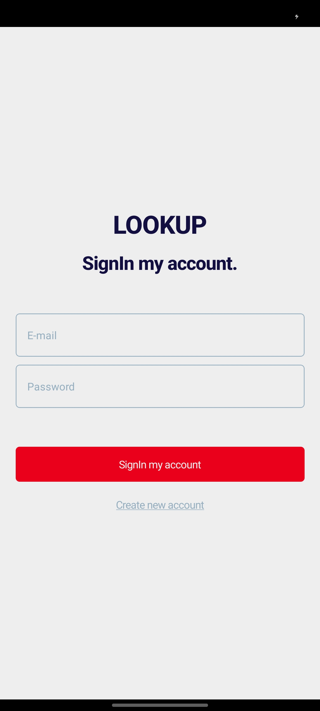

# LookApp

## Olá sejam bem-vindo

Projeto React Native Simples: Construindo uma Página Inicial Completa!

Projeto React Native Simples: Construindo uma Página Inicial Completa!
Olá, pessoal! Hoje, estou animado para compartilhar com vocês um projeto React Native que desenvolvi recentemente. É um aplicativo simples, mas com todas as funcionalidades essenciais para uma página inicial completa, incluindo login, cadastro e uma página principal dinâmica.

## O que o projeto faz?

- Página Inicial: Apresenta uma interface amigável e intuitiva, convidando o usuário a se conectar ou se cadastrar.
- Login: Permite que os usuários já cadastrados acessem sua conta com seu e-mail e senha.
- Cadastro: Oferece um formulário simples para novos usuários criarem sua conta, incluindo nome, e-mail e senha.
- Página Principal: Uma vez logado, o usuário é direcionado para uma página principal personalizada, que pode conter feeds de notícias, informações relevantes ou outras funcionalidades, de acordo com suas necessidades.

## Tecnologias utilizadas:

React Native: Framework de desenvolvimento de aplicativos móveis multiplataforma, permitindo a criação de interfaces nativas com JavaScript.

### Link:

> Linkedin: https://www.linkedin.com/in/dalio-s-yamada/

#reactnative #desenvolvimentomobile #experienciadousuario #linkedin

## Imagens:

<div align="center"> 
  
  
  
  
  
</div>

# Começando

> **Observação**: certifique-se de ter concluído as [instruções do React Native](https://reactnative.dev/docs/environment-setup) - Configuração do ambiente até a etapa "Criando um novo aplicativo" antes de continuar.

## Etapa 1: inicio

Instale yarn

```bash
yarn
```

## Etapa 2: inicie seu aplicativo

Execute o seguinte comando para iniciar esse aplicativo

```bash
yarn dev
```

Se tudo estiver configurado _corretamente_, você deverá ver seu novo aplicativo em execução em seu _Android Emulator_ em breve, desde que tenha configurado seu emulador/simulador corretamente.

Esta é uma maneira de executar seu aplicativo – você também pode executá-lo diretamente no Android Studio e no Xcode, respectivamente.

# Saber mais

Para saber mais sobre React Native, dê uma olhada nos seguintes recursos:

- [React Native Website](https://reactnative.dev) - saiba mais sobre React Native.
- [Getting Started](https://reactnative.dev/docs/environment-setup) - uma **visão geral** do React Native e como configurar seu ambiente.
- [Learn the Basics](https://reactnative.dev/docs/getting-started) - um **tour guiado** pelos **básicos** do React Native.
- [Blog](https://reactnative.dev/blog) - leia as últimas postagens oficiais do React Native **Blog**.
- [`@facebook/react-native`](https://github.com/facebook/react-native) - o Código Aberto; **repositório** GitHub para React Native.
